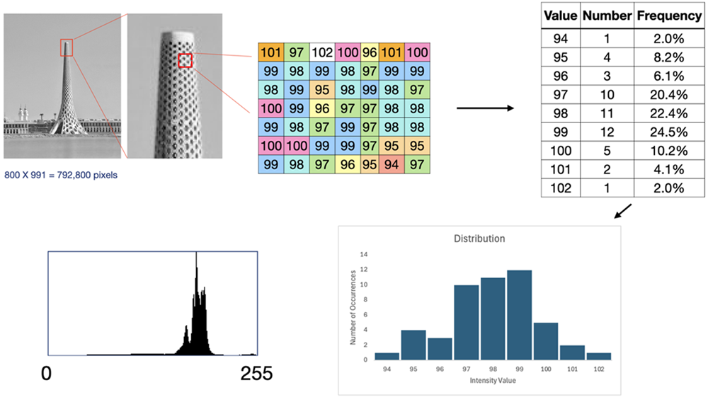
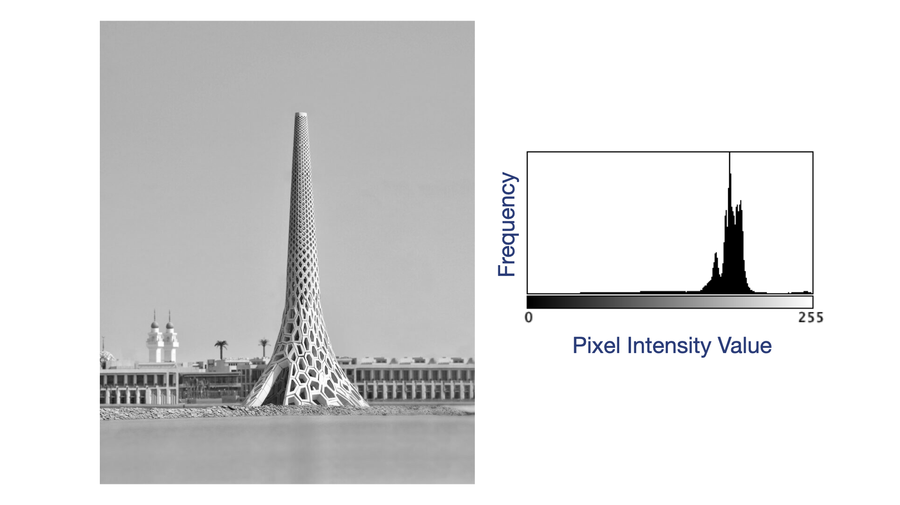
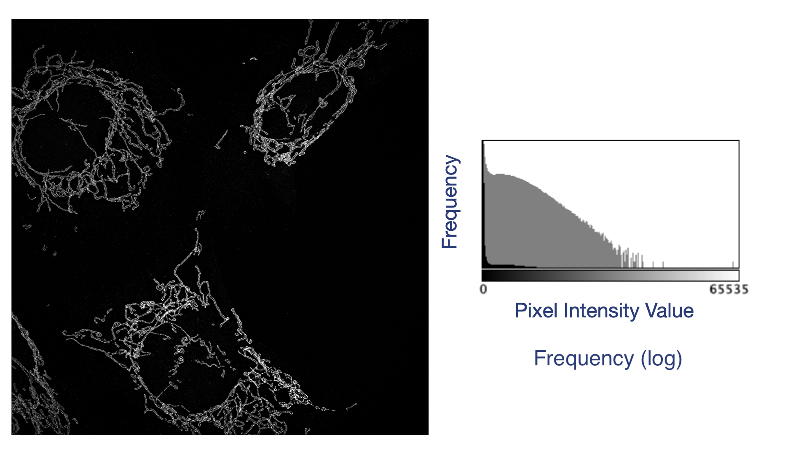

:::::::::::::::::::::::::::::::::::::: questions 

- What is an image histogram?
- How do you create image historgrams with Fiji?
- How does the *image display* relate to the underlying *image data array*.
- How can I change the image size

::::::::::::::::::::::::::::::::::::::::::::::::

::::::::::::::::::::::::::::::::::::: objectives

- Create an image histogram from an image window
- Interpret the type of image from the image histogram.
- Adjust the Brightness & Contrast of an image
- Crop/Scale an image

::::::::::::::::::::::::::::::::::::::::::::::::

## Introduction

In this lesson we will explore some of the basic functions you will need 
to build upon for more complex processing tasks.  

We will investigate two related topics in this lesson, 
image histograms and brightness/contrast adjustments. Afterwards, 
we will learn how to perform basic geometric manipulations, such as cropping,  
scaling, translation and rotation.

## Image Histograms

Recall that images are actually arrays of numbers that are displayed in a modified 
cartesian coordinate system and colored by the computer according to a lookup table. 
But there are other ways to visualise this popuation of numbers. Instead of displaying 
them in a coordinate system, we can examine the statistical properties of the 
collection of image data values. In statistics, one of the first questions we ask about 
a set of data is what does the data look like -- that is, what is the distribution? 
In image porcessing, the image array distribution is often called an "image histogram". 
See the image below for a visual explanation of image histograms.
 

{
   alt='an image depicting building an image histogram from a small subset of pixels in an image'
}

This image shows the pixel intensity values from a small subset (7 X 7 pixels) of the KAST Beacon image. 
All pixels with the same value are colored identically and counted to create a table of two columns with values 
and the number of pixels that have that value. The frequency column is calculated by dividing the Number column by 49 
(the total pixel number) and a histogram of these 49 pixels is displayed. The final panel on the bottom 
left of the image is the histogram calculated for every pixel in the image. 
Although axes are rarely labelled on image histograms, 
the X-axis of a histogram is the data range of the image 
(e.g. an 8-bit image histogram includes values from 0 to 255 on the X-axis). 
The Y-axis is the frequency or the number of occurrences of each value on the X-axis.
Consider the following image of the beacon at KAUST and its associated image histogram. 
The image is an 8-bit image and therefore the X-axis of the histogram displays a range from 0 to 255, 
while the image dimensions are 800 by 991 pixels, so the histogram shows the distribution of these 792,800 numbers.

  

{
   alt='an image of the KAUST Beacon alongside its image histogram'
}

Photos typically have a broad range of values, therefore the distribution of intensities 
varies greatly depending on the lighting conditions. This is a comparatively bright image, 
hence the majority of the pixel intensity values are distributed towards the higher end of the range.
Note that the usual *convention* in scientific image processing is to assign 0 to the color black 
and 255 to the color white.  

Scientific images, especially fluorescence micrographs, contain ***quantitative information*** 
that signifies something being measured. 
In the image below, a human cell line was propagated on glass coverslips. 
A cellular component of the mitochondria has been labelled with a fluorescent probe. 
The micrograph not only captures the spatial location of mitochondria within cells, 
but also the amount of the fluorescent probe present at each pixel position. 
Pixels with higher values contain more of the probe. Comparison of similar images taken at different times or after 
treatment with different drugs can reveal the underlying changes in the location and quantity of 
mtochondria. 
  

{
   alt='a fluorescence microscope image of labelled actin cytoskeleton in cells and its associated histogram.'
}

Fluorescence images have a predictable distribution. Many dark pixels (with values near 0). 
The histogram of the fluorescence image illustrates this perfectly. 
This image has values that range from 0 to 65,535 -- it's 16-bit data.  
This is reflected in the values shown on the X-axis of the histogram. 
It has pixel dimensions of 2560 X 2560, for a total number of data points equal to 6,553,600 pixels. 
The distribution is depicted twice, once in black bars and once in gray.
The gray bars are displayed with a different Y-axis scaling. 
In the gray version of this graph, the Y-axis is the log of the frequency. 
Because there are so many pixels with values near 0, 
the few pixels with higher values are hard to visualise. 
Log tranformation makes it easier to see the number of pixels with higher intensity values.

### Creating Histograms with Fiji

Fiji provides an easy(?) way to create histograms from images. Open any image. 
Fiji has a selection of images fo ryou to use for experimentation.

## Brightness and Contrast

Brightness and contrast adjustment is one of the most common image display operations in Fiji, 
but it is important to recognize that these adjustments affect how an image is displayed in the image window, 
not the underlying pixel values. The Brightness & Contrast tool uses the image histogram to 
map the range of pixel intensities onto the available display range. 
The histogram provides a visual summary of the distribution of pixel intensities, 
allowing you to identify whether most pixels occupy only a small portion of the available intensity range. 
By adjusting the minimum and maximum display values, you can improve the 
visibility of dim structures or reduce the influence of exceptionally bright pixels. 
As you move these limits, pixels below the minimum display value appear black, 
while pixels above the maximum display value appear white, 
with intermediate intensities scaled proportionally between these limits. 
When adjusting fluorescence images, use the histogram as a guide to avoid clipping 
large portions of the intensity distribution unless there is a clear justification, 
as excessive clipping can obscure biologically relevant features 
or create a misleading visual representation.

In addition to adjusting the display range, Fiji also provides a *gamma* adjustment, 
which changes the relationship between pixel intensity and displayed brightness. 
Unlike brightness and contrast adjustments, which apply a linear mapping of intensities, 
gamma applies a nonlinear transformation that selectively emphasizes either dim or bright features. 
A gamma value less than 1 brightens low-intensity pixels, making faint structures easier to visualize, 
whereas a gamma value greater than 1 darkens lower intensities, preserving brighter features. 
Although gamma adjustment can improve visualization, 
it changes the perceived relative brightness of image features and 
therefore has the potential to alter how an image is interpreted. 
For this reason, gamma should be used cautiously and consistently, 
particularly when comparing multiple images.

::::::::::::::::::::::::::::::::::::: caution 

Gamma adjustment is a segue into the concept of ethical image presentation, 
a fundamental principle of scientific imaging. 
Display adjustments should improve the visibility of genuine image features 
without introducing misleading artifacts or altering the scientific conclusions 
that can be drawn from the data. Brightness, contrast, and gamma adjustments 
should be applied uniformly across images that will be directly compared, 
such as experimental and control samples. 
Selectively enhancing only one image or excessively clipping intensity values 
can exaggerate differences or obscure important information. 
Because display adjustments do not modify the underlying pixel values, 
they are generally acceptable for image visualization; however, 
any permanent changes to pixel intensities or nonlinear transformations 
used for publication or presentation should be clearly disclosed and 
documented in the methods section. Maintaining transparency in image processing 
helps ensure that scientific results remain accurate, reproducible, and trustworthy.

::::::::::::::::::::::::::::::::::::::::::::::::

::::::::::::::::::::::::::::::::::::: challenge 

:::::::::::::::::::::::: solution 

:::::::::::::::::::::::::::::::::

::::::::::::::::::::::::::::::::::::::::::::::::

::::::::::::::::::::::::::::::::::::: keypoints 

- An image histogram is a frequency distribution of the underlying image data
- Histograms can be used to help set brightness and contrast appropriately
- Brightness and contrast settings affect teh display, **NOT** the image data.
- Gamma adjsutments are non-linear introducing the possibility of misrepresentation.

::::::::::::::::::::::::::::::::::::::::::::::::

