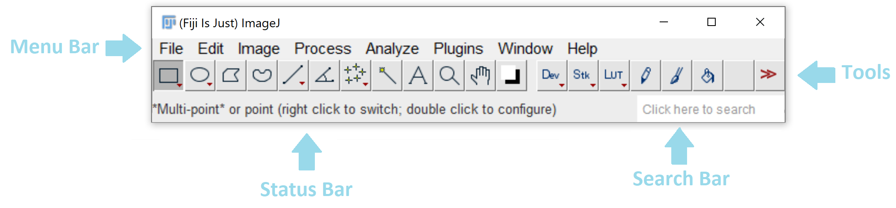
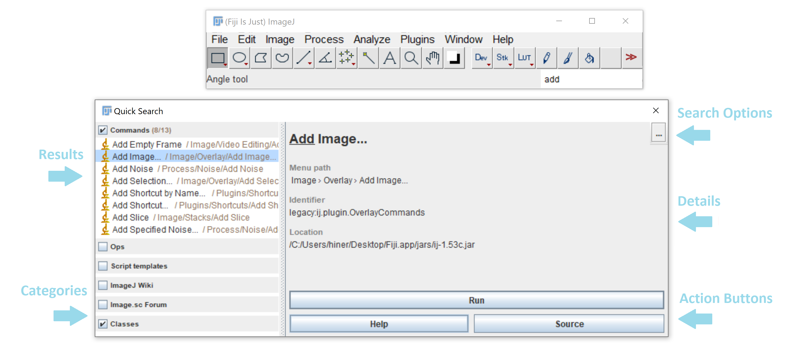
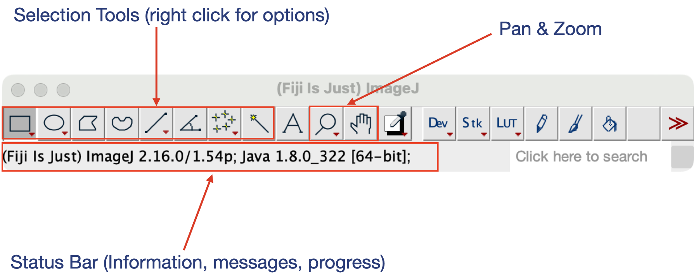
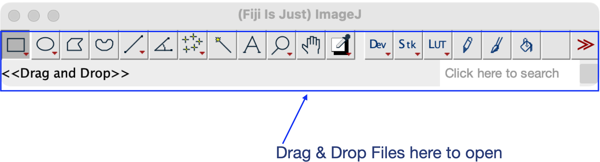

::::::::::::::::::::::::::::::::::::::: objectives

- Recognise Fiji's (ImageJ's) main window.
- Recognise how Fiji behaves when opening windows.

::::::::::::::::::::::::::::::::::::::::::::::::::

:::::::::::::::::::::::::::::::::::::::: questions

- How Do I Get Started?
- Where can I find tools to manipulate the images

::::::::::::::::::::::::::::::::::::::::::::::::::

## Installation
First, you should download and install ImageJ, ImageJ2, or [Fiji](https://fiji.sc) (for microscopy image data, use Fiji).

## The Main Window
After starting the program, you will see the main window:
{alt="Fiji main window"}
On macOS, the menu bar will appear on the top of the screen (as with all macOS applications).

#### The Search Bar

The search bar is a convenient way to quickly find and launch commands, search for documentation, and more. The search panel can be brought up by clicking and typing into the search bar, or via the keyboard shortcut ⌃ Ctrl / ⌘ + L

{alt='FIJI search results window'}

## The Menu Bar

In the menu bar, you will find most of the functionality, such as loading/saving files, processing files, measuring and manipulating windows. Plugins will be installed into the "Plugins" menu, too. On macOS, the menu bar will appear on the top of the screen, NOT in the ImageJ window (as with all macOS applications).

The menus have different purposes:

|Menu|Purpose|
|-----|-----|
|File|File input/output, new files|
|Edit|Selection/ROI handling|
|Image|Image Visualization,Information Stack Manipulation|
|Process|Image filters, Image Calculator|
|Analyze|Measurements, Statistics|
|Plugins|Plugins, Macros and Utilities|
|Window|Windows|
|Help|Update, Help & Links|

## The Tool Bar & The Status Bar

The toolbar contains selection tools: the rectangle, ellipse, polygon, freehand and straight line selection tools. By clicking on the icon, you activate the tool. Some tools offer option dialogs which you can open by double clicking the icon. If there is a small red arrow in the lower right corner of the tool icon, you can right-click and select an alternative selection tool (e.g. the rectangle tool can be a "rectangle", "rounded rectangle", or "rotated rectangle").  

The status bar is dynamic. It displays useful information at startup, and when running plugins. By default, it shows the search bar on the right, but this changes to a progress bar during long-running processes:

{alt="fiji main window with selection tools highlighted"}

## Drag & Drop

You can drag files from your favorite file manager and drop them on the main window; ImageJ will load the corresponding files.

Drag ‘n Drop will also work for images displayed in your web browser, unless they are links to other web pages. You can try with images from this page.

{alt="fiji main window with drag 'n drop highlighted"}
