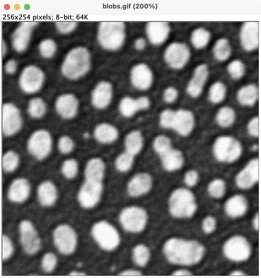
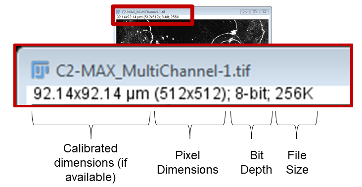

::::::::::::::::::::::::::::::::::::::: objectives

- Recognise Fiji's behaviour upon opening an image.
- Recognise the different components of an image window.

::::::::::::::::::::::::::::::::::::::::::::::::::

:::::::::::::::::::::::::::::::::::::::: questions

- Where can I find out basic image information?
- How does Fiji deal with multi-dimensional images?

::::::::::::::::::::::::::::::::::::::::::::::::::

## The Image Window

Whenever you open an image, be it via File › Open, Drag ‘n Drop or File › Open Samples, ImageJ will open an image window:

{alt="screenshot of the blobs sample image from Fiji"}

The window has the file name as its title. It also displays some useful information above the image:

 - If the image is calibrated, the real linear dimensions (there is no scaling information in the blobs image, therefore no dimesnions shown, but see below for an example in $\mu$m.)
 - The pixel dimensions
 - The image type/bit-depth
 - The memory required by the image

 See the image below with these details enlarged as an example:

{alt="screenshot of an image window with details enlarged"}

- scaling information is available so the image dimensions are displayed as 92.14x92.14 $\mu$m
- the image is composed of an array 512 pixels in the X dimension and 512 in the Y direction.
- The image type is 8-bit grayscale
- The image takes 256kilobytes to store or load into memory.

Notice below in the screenshot of my desktop that many types of windows can be open in Fiji. The windows are not restricted to any type of application space, they are free to float over the whole desktop. 

{alt="screenshot of an image window with details"}